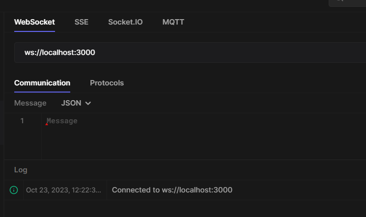

# Realtime communications and distributed computing

## System design of a distributed chat system

#### Why WebSockets?

1. Http is great, but doesn't cover a few usercases. <br>
2. The most important use case it doesn't cover is server side events. <br>
3. What if you want to create a realtime application? like
   zerodha or Binance<br>
   
In normal https, server can't directly send you events. client ask the server and server responds, what if your application is realtime. let say you have a webapp and a mobile app. changes in one should be seen imediately in the other. like notion or let say google docs, if you make changes in one file in google docs in one tab and open the same file in another pc it will show the changes in realtime.
#### So to create a realtime application we need a protocol that gives a **<span style="background-color: darkblue;">Persistent</span>**  connection between client and server. and that is websockets. A continuous connection will let the client constantly know the changes in the server using TCP. 
Let say two users are chatting with each other. one user send a message to the other using a htpps request. here you can  say the client does polling after let say every 1 seconds. this is called **<span style="background-color: darkblue;">long polling.</span>** but this is not **<span style="background-color: darkblue">efficient .</span>** because the client is constantly asking the server if there is any new message. Another is **<span style="background-color: darkblue;">Server Side Events</span>** that is SSE. It sends events from server to client. but it is not **<span style="background-color: darkblue;">bidirectional .</span>** So we need a protocol that is bidirectional and that is websockets. Under the hood in http there is handshake between client and server. it works on transport layer and creates a **<span style="background-color: darkblue;">TCP</span>** connection and after the request is completed it **<span style="background-color: darkred;">closes</span>** the TCP connection it is not persistent connection.

Compare to WebSocket Sever the goal is to create a persistent connection between the server and the client. The browser sends request to the server and server sends something or some data to the browser or client.

**<span style="background-color: darkblue;">Both Http and WebSocket are different Protocols/Standards.</span>** 

**<span style="background-color: brown;">#### Interview Question</span>** 
1. Is WebSocket http or not? <br>
answer: It is not http but the first request that you send out( from client or browser) when you want to create a webSocket connection to any open server. that request is a http request.but after that under the hood it gets updated to a WebSocket connection that is persistent connection to the backend.

to check if it is a websocket connection you can inspect in a page and go to network and see the headers the request url is **<span style="background-color: darkblue;">wss://</span>** and a lot of connection stream of data. its not you repeatedly asking the server with request . its the server sending you events pushed down by backend in webSocket.

**<span style="background-color: darkblue;"> ##### WebRTC</span>** also lets you get data its a similar approach but it has its differences.


**<span style="background-color: brown;">#### Interview Question</span>** 
1. Difference between WebRTC and WebSockets and when to use what ? <br>
   answer: WebRTC uses **<span style="background-color: darkblue;">UDP</span>**  while Websockets uses **<span style="background-color: darkblue;">TCP .</span>** </br>
   a. if you need all info you use WebSockets if you are ok with some data loss you can use WebRTC. like live stream, gaming <br>

TCP: Transmission Control Protocol. It is a connection oriented protocol. It is reliable and slower than UDP. It is used for applications that require high reliability, and transmission time is relatively less critical. Ex: HTTP, HTTPS, FTP, SMTP, Telnet etc.   

UDP: User Datagram Protocol. It is a connectionless protocol. It is unreliable and faster than TCP. It is used for applications that require fast transmission, such as games. Ex: DNS, DHCP, TFTP, SNMP, RIP, VOIP etc.

#### HTTP is not enough
When you need realtime updates from the backend
You could
1. Use long polling
2. Use server side events
3. Use websockets

What are WebSockets?
WebSockets is a communication protocol that provides a **<span style="background-color: darkblue;">full-duplex communication</span>** channels over a single, long lived connection. they are not shortlived.

so is there only server where everyone connects to or are there multiple servers? and those servers talk to each other and propogate data or changes. or are there **<span style="background-color: darkblue;">swarm</span>** of servers where each server can connect to x number of users? here is where **<span style="background-color: red;">redis</span>** comes in.

Websocket is node js specific concept? No. it's a protocol it can be written in any language. like there are many libraries in nodejs to create a http server like express just like that there are many npm library to create a websocket server. like **<span style="background-color: darkblue;">socket.io</span>** or **<span style="background-color: darkblue;">ws</span>** or **<span style="background-color: darkblue;">websocket</span>**. socket /io is not completly websocket it is some abstraction on top of websockets. It has a room creation feature out of the box. It is not used in production servers because if you use it, your client also needs to talk to socket.io and it is not the exact websocket protocol you can tweak it though like you can create a normal websocket connection which talks to socket.io but your anroid, ios, golang client they dont understand socket.io they only understand websockets. It became popular because someone wrote socket.io client, c++, android etc but still it is not widely used. **<span style="background-color: darkblue;">Websocket protocol or Raw websocket is widely used even if a interviewer ask what should you use in production socket.io or raw websocket you should say raw websocket why ? because it is proven widely used and someone has written a client for it in every language, android, ios, c++, golang etc .</span>**

just like fetch websocket is a browser api. this is client side code.
like you use fetch.

Webhooks: For example you use razorpay which lets you do payments. Razorpay uses http server. razorpay's http server will send request to your http server and this is called webhooks. if your payment fail from a bank let say. users request hits the razorpay endpoint but razorpays endpoint then bank's enpoint has to tell razorpays endpoint about the transactions and then razor pays endpoint has to tell my endpoint about the transaction. so this is called webhooks. so razorpays server talking to my backend through different banks servers or across servers is called webhook. the protocol there is still TCP but this communications between different servers is called webhook.

A Websocket is completely different thing, it is realtime communication between client and server. and completely different from webhooks. where as webhooks is communication across different servers.

import http from "http"; is a native http server that comes with nodejs out of the box. you can create a http server with it we will use express. 

```javascript
const server = http.createServer(app);
``` 
 //http is native nodejs to create a http server of express app.
```javascript
wss = new WebSocketServer({ server }); 
```
 websocketserver needs a parameter that is a http server. so we are passing the express server to it. so that it can create a websocket server on top of it.
**<span style="background-color: darkblue;"> So this has the logic to send the first http request and upgrade it to a persistent long live connection .</span>**


#### Server Side Code

```javascript
wss.on("connection", async (ws, req) => {
    console.log("someone connected");
    ws.on("message", (message) => {
        console.log("received: %s", message);
        ws.send(`Hello, you sent -> ${message}`);
    });
});
```
websocket on connection or if someone connects to the server the control reaches the console log and prints "someone connected".
wss.on message, that means when someone sends a message to the server. you can perform some action like a console log message or do database operation. This above code shows the **<span style="background-color: darkblue;"> Full Duplex </span>** nature of websocket. since client can send a message to the server and server can send a message to the client. This is kind of a simple example of sever side code. in here async (ws, req) ws is the websocket connection for that **<span style="background-color: darkblue;"> particular client/user .</span>**

Websocket connection can also be hit by a client/browser/postman/postwoman(hopscotch.io) etc.


<br/><br/>


#### Client Side Code

```HTML
<html>
    <head>
        <title>Simple WS Client</title>
        <script>
            const webSocket = new WebSocket("ws://localhost:3000");  
            function sendMessage() {
                webSocket.send(document.getElementById("inputbox").value);
            }
            webSocket.onmessage = function (event) {
                document.getElementById("serverMessages").appendChild(document.createTextNode(event.data));
                document.getElementById("serverMessages").appendChild(document.createElement("br"));
            }
        </script>
    </head>
    <body> 
        <input type="text" id="inputbox" />
        <button onclick="sendMessage()">send</button>
        <br/><br/>
        <h2>
            Events from server
        </h2>
        <div id="serverMessages">

        </div>
    </body>
</html>
```

const webSocket = new WebSocket("ws://localhost:3000");  // you can use axios/fetch in react here, we are using Raw WebSocket Client here by passing URL to our backend server. 
webSocket.onmessage = function (event) // when a server sends message to the client using function **<span style="background-color: darkblue;"> webSocket.onmessage = function (event) </span>** is called and it will append the message to the div with id: serverMessages. so this is how you can create a simple chat application. als we have created an input box and a button to send the message to the server using **<span style="background-color: darkblue;"> sendMessage() </span>**. so this is how you can create a simple chat application.
You can either use Liveserver in VsCode extension to run this or **<span style="background-color: darkblue;">npm i -g serve</span>** npm package to run this. because file path is not allowed for this HTML to connect to WebSocket. so to folder with index.html or above file make sure its the only file present and run serve.

### An Actual Chat Application 


So people in same room connect to let say connect ws server 1. people all in room 2 connect to ws server 2 and so on. each of those members gets all chats or data/info of that room.

#### Server Side Code

```javascript
import express from "express";
import http from "http";
import { WebSocketServer } from "ws";

const app = express();
const port = 3000;

const server = http.createServer(app);

const wss = new WebSocketServer({ server });

const users: { [key: string]: {
    room: string;
    ws: any;
} } = {};
{/*.. An oject of users with keys as string and value as object with 
property room as string and ws or websocket server.*/}

let counter = 0;

wss.on("connection", async (ws, req) => {
   {/*.. When a connection happens it will increase the wsId by 1 using counter.*/}
    const wsId = counter++;
    ws.on("message", (message: string) => {    {/*first step */}

        const data = JSON.parse(message.toString());   {/*second step */}
        {/*.. Now user will send an object(json string) so you need to parse
         it since it will still be text as you get it from a browser you need to parse to get a js object.
         message.toString() converts the message into a string. JSON.parse() takes this string and converts it into a JavaScript object which is then stored in the data constant.*/}

        if (data.type === "join") {   {/*third step*/}
            users[wsId] = {   {/*fourth step will set the id increased during conenction above for the new user */}
                room: data.payload.roomId,   {/*room id from the message*/}
                ws                            {/*websocket connection for that particular user*/}
            };
            {/*.. if the type of message is join then it will create a new user with wsId as key and value as an object with room as roomId and ws as websocket server.*/}
        }

        if (data.type === "message") {
            const roomId = users[wsId].room;
            const message = data.payload.message;

            Object.keys(users).forEach((wsId) => {
                if (users[wsId].room === roomId) {
                    users[wsId].ws.send(JSON.stringify({
                        type: "message",
                        payload: {
                            message
                        }
                    }));
                }else {
                    //
                }
            })
        }
    });
});

server.listen(port);

```
 * Websocket can only send a **<span style="background-color: darkblue;">string</span>**  or a **<span style="background-color: darkblue;">binary data</span>** hence they are parsed to convert into a Javascript object.
  <br/>
 * Types of message a user can send two types of message everything else will be ignored if not json and these types. do put try catch method to catch error if it is not a json string.
  <br/>

 ```javascript
   {
      type: "join",
      payload: {
          roomId: "room1"
      }
   }

   or

   {
      type: "message",
      payload: {
          message: "Hello"
      }
   }
 ``` 

 **<span style="background-color: red;">## VVIMP</span>** </br>
 We cache the user in a in-memory object, shouldn't this be stored in a database ? <br/>
  **<span style="background-color: darkblue;">answer:</span>** no because these are realtime systems, what if database goes down?. **<span style="background-color: darkblue;"> Then everyone on the client connects to a new backend server this is called**<span style="background-color: red;"> resilience </span>**</span>**.

 ```javascript
 
 const users: { [key: string]: {
    room: string;
    ws: any;
} } = {};

 ```
  resilience refers to the ability of the system to handle and recover from failures or disruptions in the connection. This is particularly important in real-time applications where continuous and reliable data exchange is crucial. <br/>

 

 Users gets a message that disconnected from the server and everyone connects to different server as shown above now the new server has the users array all client resend the message that i want to join so and so room_id and redo everything from scratch on a new web-server this is how resilience works in WebSockets servers in companies at large scale.

 if you are going to iterate over an array it is simply. 
 ```javascript
 arr.forEach(x => console.log(x));
 ```
 But since Users is an in-memory Object, to iterate over an Object we use the inbuilt javascript function **<span style="background-color: darkblue;">Object.keys()</span>** which returns an array of keys of the object. so we can iterate over the array keys using foreach **<span style="background-color: darkblue;">forEach()</span>** function.

 ```javascript
 Object.keys(users).forEach((wsId))
 ```
 so arrays of keys of Users is returned by Object.keys and then foreach on keys which are wsId currently in this case and access individual user using users[wsId] and . then their properties. Object.keys() is a slower function though. so when server recieves message from a particular user we store the roomId and message in a variable.
 ```javascript
  const roomId = users[wsId].room;
  const message = data.payload.message;
 ```
now we will search for all users with same room id so will iterate in Users as shown above using Objects.keys() and if the room id of the users is same as roomId so individually send the message from payload to their websocket connection so all including the sender will get the message. so this is how you can create a simple chat application.

#### Client Side Code

```HTML
<html>
    <head>
        <title>Simple WS Client</title>
        <script>
            const webSocket = new WebSocket("ws://localhost:3000");
            function sendMessage() {
                webSocket.send(JSON.stringify({
                    type: "message",
                    payload: {
                        message: document.getElementById("inputbox").value
                    }
                }));
            }
            webSocket.onmessage = function (event) {
                const data = JSON.parse(event.data);
                if (data.type === "message") {
                    document.getElementById("serverMessages" ).appendChild(document.createTextNode(data.payload.message));
                    document.getElementById("serverMessages").appendChild(document.createElement("br"));
                }
            }
            {/*.. When the connection is open extract the roomid from the URL  through window.location.search get the roomid and send to backend*/}
            webSocket.onopen = () => {
                const urlParams = new URLSearchParams(window.location.search);
                const roomId = urlParams.get('roomId');  
                webSocket.send(JSON.stringify({    {/*Once you get the room ID you send the first message that of type join then as previous stores in an inmemory object user and creates a user with userId and a object with roomid and ws server*/}
                    type: 'join',
                    payload: {
                        roomId: roomId
                    }
                }));
            }

        </script>
    </head>
    <body>
        <input type="text" id="inputbox" />
        <button onclick="sendMessage()">send</button>
        <br/><br/>
        <h2>
            Events from server
        </h2>
        <div id="serverMessages">

        </div>
    </body>
</html>
```

first message automatically goes out with type: join and payload with roomid from the URL.
<br/><br/>

<br/><br/>
Two clients connected to the same room with realtime chat application with roomId = 123 if a new user joins another room then this user will not get the message of the other room.
<br/><br/>


* When we refresh the data is lost. how to fix it ? <br/>
  answer: So the first request can be a http request to a database to get the stored chat or previous chat info's hence the first request is an Http request. the next request will be a realtime chat with Websockets so initial request is http to get back previous chats.

  ### Large scale Distributed Computing

  Now let say a company has 20 thousand users and a constrain that users with same room id should be on the same websocket server but the problem is servers has a limit of 10 thousand users. so what to do ? and most of the time it is relayed by a third server to which the first http request is sent let say client wants to connect to roomId = 123 it is send from the url as params to the server and server responds ok join roomId = 123 and another user joins the same room but what if server crash then again the client calls the third server send a roomId as a params url through http the same process again so this is no efficent since there is a cap on number of users.<br/>

* ### Using a Load-balancer
  let say the client randomly connects to a websocket server (ws1) through a load balancer. if user 1 sends a message to room 1 and since websocket server is radomly allocated how will user 2 get the message sent by user1 since it is connected to different websocket server let say ws3. how will the message of user 1 get to user 2? so ws1 somehow has to forward the message to ws3 and ws3 has to send message or data to the user2.
<br/><br/>

<br/><br/>

```javascript
    users[wsId] = {
        room: data.payload.roomId,
        ws
    };
```

You can't store the ws server in a database since this is an object .**<span style="background-color: red;"> Wrong solution </span>**. and let the user2 get acess to the ws server and get data from database on where to connect because its a realtime connection you can't put it in a database and also they are in memory objects.<br/>

* ### Solution: Pub subs
* Disadvantage of using a pub subs or not putting on same server, **<span style="background-color: red;"> Latency increases </span>** 
<br/><br/>

<br/><br/>

Pub subs means publish and subscribe. so ws1 will publish the message(hi i am swaraj) to the pub sub and ws3 will subscribe to the pub sub and get the message. <br>
Then why do we even use websocket server ? why not just use pub sub ? <br>
1. Because first you shouldn't expose pub subs to the client they are meant to communicate with backend servers so that backends can talk to eachother.
2. You can't directly make browsers and pubsubs lie redis or kafka talk to each other.
<br/><br/>

<br/><br/>
